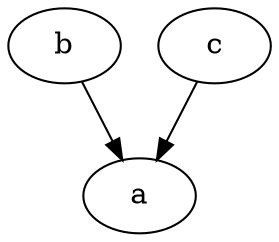
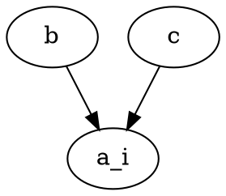

# Conditional normals

Conditional normals are the basic building block for linear models.
Suppose we start with a jointly-distributed multinormal, with edges
parametrized by their marginal correlations (calculated from the precision
matrix): 

```dot
graph {
    a--b(0.1);
    b--c(0.1);
    a--c(0.1);
}
```

We represent that by:

```rust
let joint = MultiNormal::likelihood([[a1, b1, c1], [a2, b2, c2], [a3, b3, c3]]);
```

# Homoscedastic case

We decide the variables b and c are fixed (i.e. are set at their
likelihood values with probability one). We represent that by just calling
likelihood with a single value, which makes them yield zero variance.
This transforms the joint undirected graph in a directed graph, where
the dependent variable is a exponential-family implementor parametrized
by the regression coefficients and with sufficient statistic given by
the sum of squares of the fixed variables and the sum of cross products
with the fixed and random variables. 



We represent that by:

```rust
let cond = joint.fix(1..)
```

# Heteroscedastic case

We further decide that b and c are fixed, but for our problems's reasons, a has a different
variance for each observation. Following the heteroscedastic univariate case, we build
an array of multivariates to allow for the conditional to have a different variance for
each realization. 

```rust
let rows = [[a1, b1, c1], [a2, b2, c2], [a3, b3, c3]];
let joint : Box<MultiNormal> = (0..3).map(|i| MultiNormal::likelihood(rows[i]) ).collect();
let cond : Box<[Normal]> = joint.fix(1..).unwrap();
```



Both `MultiNormal` and `[MultiNormal]` satisfy Fixed, and we use the second case to allow
for heteroscedastic observations. 

We use the fix(.) API because the likelihood(.) call effectively compresses the data
into a sufficient statistic. The sufficient statistic for the conditional (the crossed
products and squared products) can be retrieved from the sufficient statistic of the joint
(accessing the upper row of the covariance and the bottom rows of the covariance) in the
homoscedastic case. In the heteroscedastic case, by collecting the distributions into a 
container, we set the MLEs to the raw data values, effectively copying them instead of
calculating the sufficient statistic, leaving the data available for any estimators
that want to deal with the data in a way other than compressing it into a sufficient
statistic.

For the heteroscedastic case, the sufficient statistics are the weighted regression 
weights, X^T \Sigma^{-1}_y X and X^T \Sigma^{-1}_y y. 
